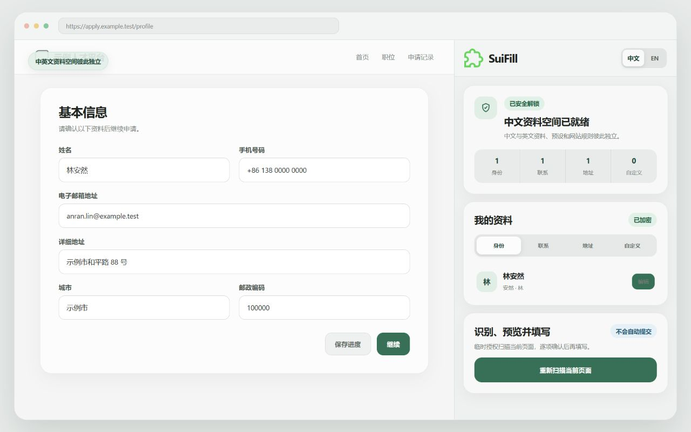
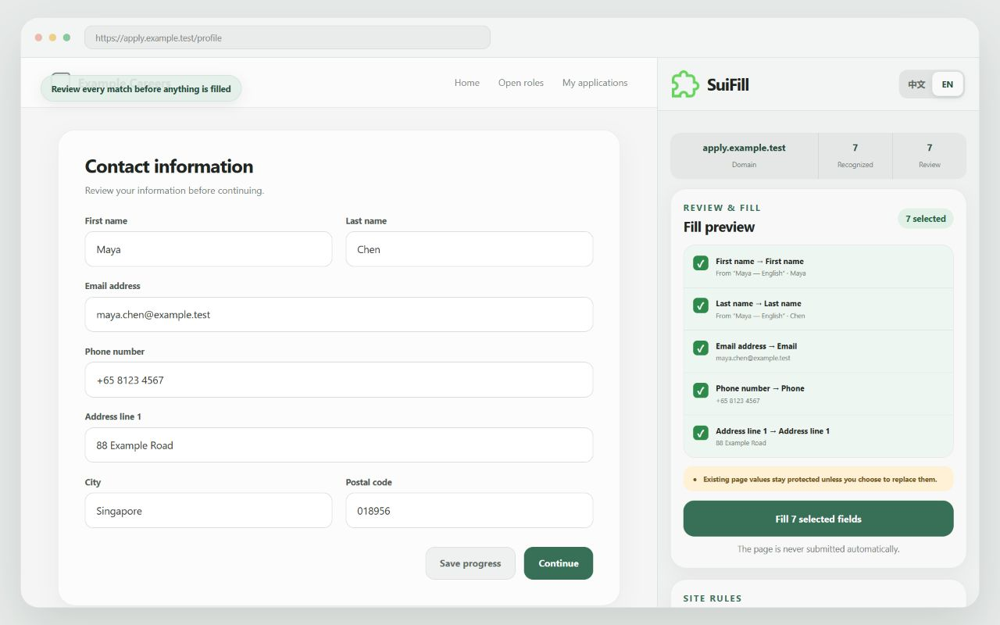

# SuiFill 随填

> Local-first, bilingual form filling for Chrome and Edge — users review every field before anything is filled.

[](CHANGELOG.md)
[](wxt.config.ts)
[](PRIVACY.md)
[](docs/test-plan.md)

SuiFill helps people keep multiple identity, contact, and address profiles in an encrypted local vault, scan the current form, review the proposed matches, and fill only the fields they select. It never submits a form automatically.

中文与英文是彼此独立、功能对等的资料空间。用户可以分别维护中文资料与英文资料、场景预设和网站规则，同时扫描器能够识别常见的中英文字段标签。

## Product preview

| Profiles and presets                                                                    | Review before filling                                                                             |
| --------------------------------------------------------------------------------------- | ------------------------------------------------------------------------------------------------- |
|  |  |

## Highlights

- Separate Chinese and English workspaces with equivalent capabilities.
- Multiple identity, contact, address, custom-field, and scenario profiles.
- Local AES-GCM encrypted vault; no account, backend, telemetry, or advertising.
- Temporary current-tab access rather than persistent access to every website.
- Bilingual form classification using labels, accessibility metadata, field attributes, and bounded page structure.
- Field-by-field preview with confidence levels and explicit user selection.
- Existing page values are protected by default; replacement is opt-in for the current fill action.
- No automatic submission, navigation, purchase, registration, or confirmation clicks.
- Encrypted backup export/import, master-password changes, manual locking, and permanent local deletion.
- Exact-host encrypted field rules for difficult websites.

## Privacy model

SuiFill is designed around a narrow data boundary:

1. The encrypted vault stays in browser extension storage.
2. Page scans run only after the user explicitly invokes SuiFill.
3. The scanner never reads existing input values or password fields.
4. The preview stays inside the extension side panel.
5. Only checked locator/value pairs reach the exact page that was scanned.
6. The destination page is never submitted by SuiFill.

Read the complete [Privacy Notice](PRIVACY.md), [Threat Model](docs/threat-model.md), and [Permission Rationale](docs/permissions.md).

## Install from source

Requirements: Node.js 20+ and pnpm.

```bash
git clone https://github.com/RogerChennnn/SuiFill.git
cd SuiFill
pnpm install
pnpm build
```

Then:

1. Open `chrome://extensions` in Chrome or `edge://extensions` in Edge.
2. Enable **Developer mode**.
3. Select **Load unpacked**.
4. Choose `.output/chrome-mv3/`.
5. Pin SuiFill and click its toolbar icon on the page you want to scan.

An unpacked-extension warning is normal when installing a build directly from source.

## Development

```bash
pnpm install
pnpm dev
```

Run the complete release check:

```bash
pnpm check
```

This checks formatting, TypeScript, unit tests, and the production Chrome build. The current suite contains 102 tests.

Create a Chrome/Edge store package:

```bash
pnpm zip
```

The generated build and zip are placed under `.output/` and are intentionally not committed.

## Project structure

```text
core/                         Vault, form classification, fill planning, and rules
entrypoints/                  Manifest V3 background and React side panel
public/                       Icons and browser-localized strings
tests/                        Unit tests and safe fictional fixtures
docs/                         Architecture, permissions, security, and release docs
store-assets/v0.3.0/          Chrome Web Store copy and promotional artwork
```

## Release status

Version 0.3.0 is the current technical release candidate for Chrome and Edge. The Chrome Web Store listing is being prepared; until it is published, build the extension from source using the instructions above.

See the [Changelog](CHANGELOG.md), [Release Checklist](docs/release-checklist.md), and [Chrome Web Store listing kit](store-assets/v0.3.0/README.md).

## Security and support

- Security reports: follow [SECURITY.md](SECURITY.md). Do not include real personal data in a public issue.
- Product questions and reproducible bugs: use [GitHub Issues](https://github.com/RogerChennnn/SuiFill/issues) with fictional test data.

## Source availability and license

The source code is public for transparency, security review, and development. No software license has been granted yet, so copyright law reserves reuse, modification, and redistribution rights unless the repository owner later adds a license.
